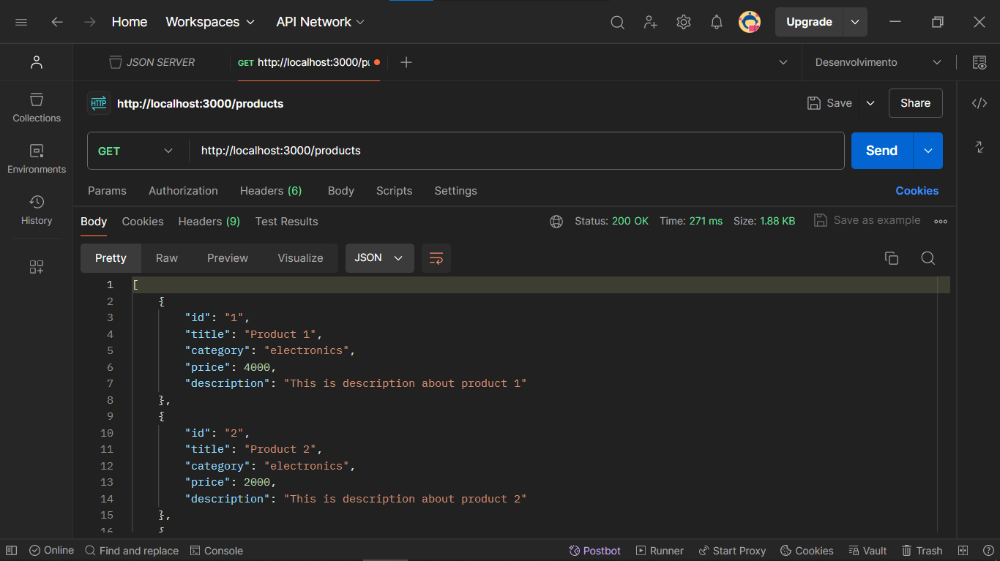
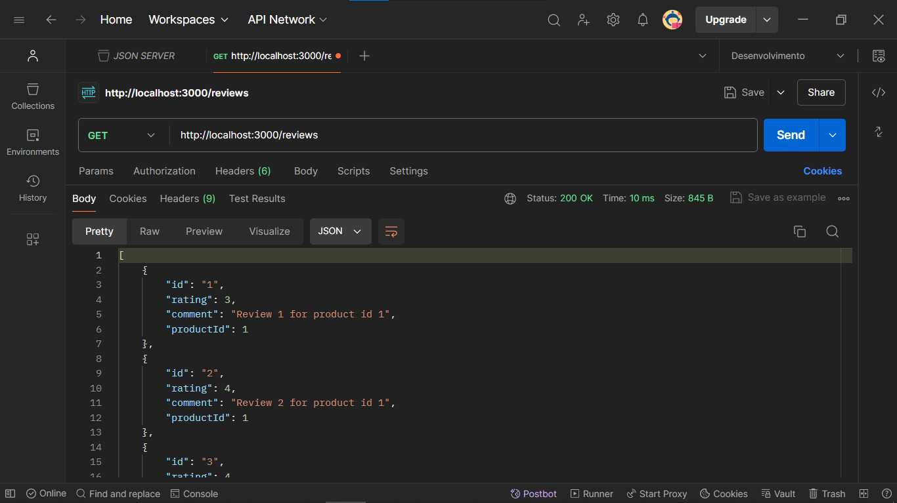
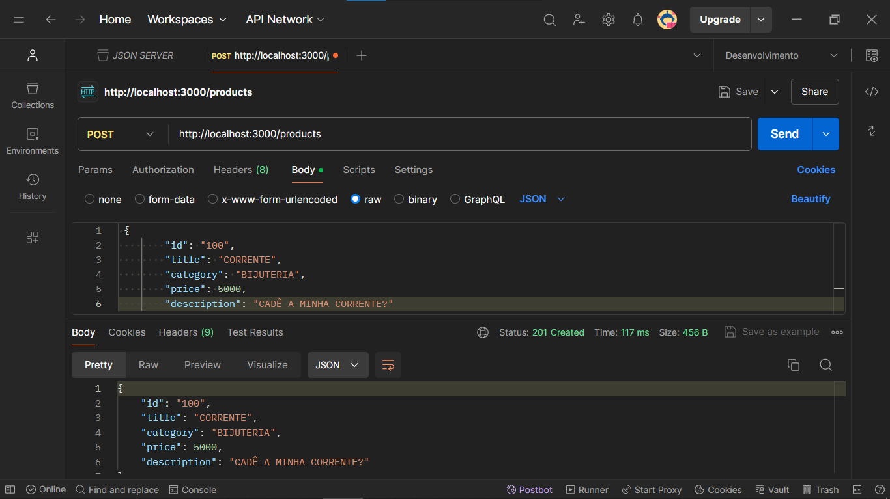
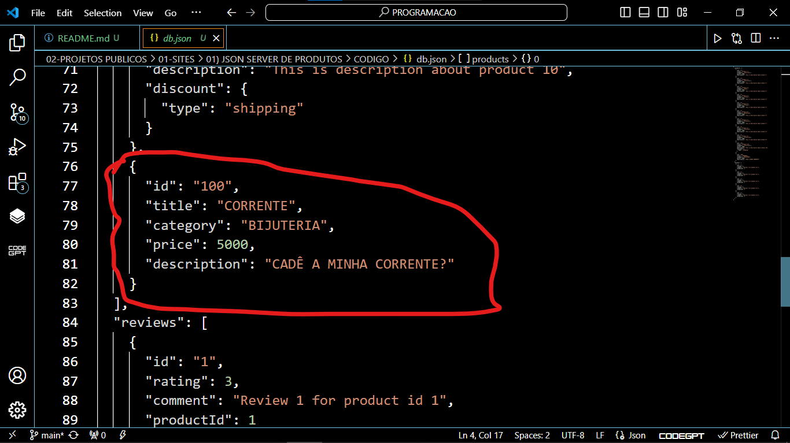
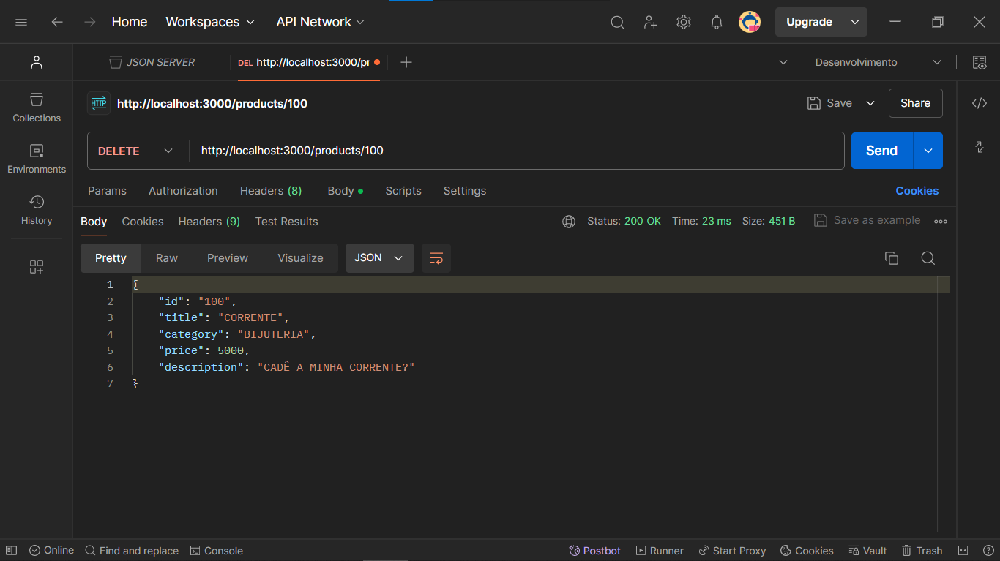
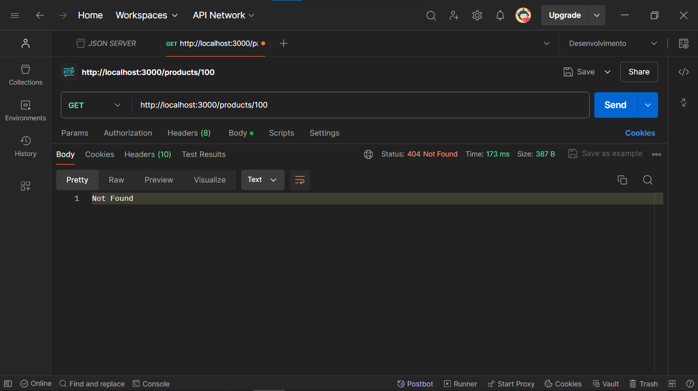

# JSON SERVER DE PRODUTOS
👨‍🏫PROJETO CRIADO PARA O CURSO DE JSON-SERVER.

 <br> 
 <br> 
 <br> 
 <br> 
 <br> 
 <br> 
 <br> 

## DESCRIÇÃO:
- Este projeto utiliza o JSON Server para criar uma API REST simulada, permitindo a realização de operações CRUD (Create, Read, Update, Delete) em um conjunto de dados armazenados localmente em um arquivo JSON (`db.json`). O objetivo é fornecer uma ferramenta rápida e fácil para desenvolvimento e testes de funcionalidades front-end sem a necessidade de configurar um backend completo.

- O JSON Server é uma ferramenta poderosa para desenvolvimento e testes rápidos, proporcionando uma API RESTful completa sem a necessidade de um backend real. Isso facilita a prototipagem e o desenvolvimento front-end, economizando tempo e esforço na configuração inicial.

- Como bônus, incluí o arquivo `data.js`, que permite gerar 1000 produtos aleatórios! 😈

## FUNCIONALIDADES:
1. **Listar Produtos**: Obtenha uma lista de todos os produtos disponíveis.
2. **Adicionar Produto**: Adicione novos produtos ao banco de dados.
3. **Atualizar Produto**: Atualize as informações de produtos existentes.
4. **Deletar Produto**: Remova produtos do banco de dados.
5. **Listar Avaliações**: Obtenha uma lista de todas as avaliações.
6. **Adicionar Avaliação**: Adicione novas avaliações aos produtos.
7. **Filtragem, Paginação e Ordenação**: Realize operações avançadas como filtragem por categoria, paginação de resultados e ordenação por preço ou qualquer outro campo.
8. **Relacionamento entre Produtos e Avaliações**: Visualize as avaliações associadas a um produto específico.

## ESTRUTURA DO `db.json`
O arquivo `db.json` contém dois conjuntos de dados principais: `products` e `reviews`.

### Produtos (`products`)
Cada produto possui os seguintes campos:
- `id`: Identificador único do produto.
- `title`: Nome do produto.
- `category`: Categoria do produto (ex: electronics, books, fitness).
- `price`: Preço do produto.
- `description`: Descrição do produto.
- `discount` (opcional): Tipo de desconto disponível para o produto.

#### Avaliações (`reviews`)
Cada avaliação possui os seguintes campos:
- `id`: Identificador único da avaliação.
- `rating`: Classificação da avaliação (ex: 3, 4, 5).
- `comment`: Comentário da avaliação.
- `productId`: Identificador do produto ao qual a avaliação está associada.

## EXECUTANDO O PROJETO:
1. **Instalar as dependências do projeto**:
   - Execute o comando no diretório `CODIGO/`:
     ```cmd
     npm install
     ```
   Este comando instala todas as dependências listadas no arquivo `package.json` do seu projeto. Certifique-se de estar no diretório do seu projeto ao executar este comando.

2. **Executando o Aplicativo:**
   - Para subir o servidor, no diretório do seu [projeto](./CODIGO), abra outro Terminal/CMD e digite o seguinte comando:
   ```bash
   npm start
   ```
   - Acesse o APP no navegador visitando `http://localhost:3000/products` e `http://localhost:3000/reviews`.

3. **Consultando API:**
   - Para testar a API, você pode utilizar uma ferramenta de cliente HTTP, como o **Postman**, **Insomnia**, **Paw** ou **SoapUI**. Você pode acessar a API usando os seguintes links:
   ```
   http://localhost:3000/products
   ```

   ```
   http://localhost:3000/reviews
   ```

4. **Testando API:**
   - Você pode usar ferramentas como Postman ou cURL para testar os endpoints da API. Aqui estão alguns exemplos de solicitações que você pode fazer:
      - **Obter todos os produtos**: `GET /products`
      - **Obter um produto específico**: `GET /products/1`
      - **Adicionar um novo produto**: `POST /products`
      - **Atualizar um produto existente**: `PUT /products/1`
      - **Deletar um produto**: `DELETE /products/1`
      - **Obter todas as avaliações**: `GET /reviews`
      - **Obter avaliações de um produto específico**: `GET /products/1/reviews`

## COMO USAR O `./CODIGO/data.js`?
Se você estiver muito entediado, você poderá gerar 1000 produtos aleatórios usando um script Node.js.

Para gerar o arquivo `db.json`, abra o terminal, navegue até o diretório `./CODIGO/data.js` e execute o seguinte comando:

```bash
node data.js
```

Este comando executa o script Node.js que gera e escreve os dados aleatórios no arquivo `db.json`. Você deve ver uma mensagem de confirmação no terminal: "db.json has been generated with random data!"

Após executar o script, verifique o arquivo `db.json` no mesmo diretório. Ele deve conter os dados aleatórios gerados pelo script.

## NÃO SABE?
- Entendemos que para manipular arquivos em `HTML`, `CSS` e outras linguagens relacionadas, é necessário possuir conhecimento nessas áreas. Para auxiliar nesse aprendizado, oferecemos cursos gratuitos disponíveis:
* [CURSO DE HTML E CSS](https://github.com/VILHALVA/CURSO-DE-HTML-E-CSS)
* [CURSO DE NODEJS](https://github.com/VILHALVA/CURSO-DE-NODEJS)
* [CONFIRA MAIS CURSOS](https://github.com/VILHALVA?tab=repositories&q=+topic:CURSO)

## CREDITOS:
- [PROJETO FEITO PELO VILHALVA](https://github.com/VILHALVA)
- [PROJETO CRIADO PARA O CURSO DE JSON SERVER](https://github.com/VILHALVA/CURSO-DE-JSON-SERVER)


